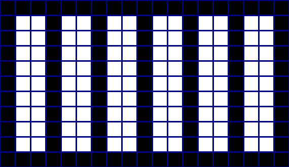
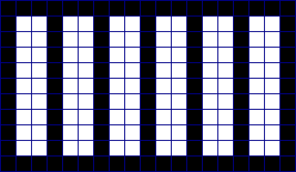

# pixel-art-scaler

pixel-art-scaler is a tool to enlarge pixel art for platforms that blur it when you upload to them.

# Why use this tool

Has the following happened to you before? you have a low-res image that is meant to be viewed
with anti-aliasing off, you upload it to some platform that completely destroys it like this

`Original:`


**smooth:**


NOTE: if the `pixelated` images look blurry, then you are viewing this on a platform that does not support the `image-rendering` CSS property, and it is for reasons like this that this tool was made

**pixelated:**


The images you see above are all from 2 files only, the difference is the size and the
image-rendering technique (if the images look different, then 
you are seeing different image-rendering techniques that are 
available in the browser, you can read more at [MDN Web Docs][MDN Web Docs image-rendering]), when dealing with
pixel art you do not want smoothing to happen as it makes the image way too different from the intended way to view it. 
In the case of the web, you can change the image-rendering technique but that is not always an option

This is where this program comes in, it enlarges pixel art while keeping it pixelated,
it also supports adding a grid to separate the pixels (useful if you want to indicate the pixel boundaries)

NOTE: these images are rendered using smooth rendering


Even with the smooth rendering, the picture's pixel art is still recognizable.

# Building

This tool is written using C++ and is meant to be built using CMake.

> NOTE: I am still learning how to use CMake, so if there is a better way to do
this, feel free to open an issue mentioning how the build process can be made
better and easier for others.

## Dependencies

* [CLI11][cli11 github]
* [ImageMagick][ImageMagick github] (specifically Magick++, tho it should be included
in most ImageMagick installs)
* [fmt][fmtlib github]

Make sure they are in a place where CMake's `find_package` can find them.  

## Building (done only on Linux)

After cloning the repo and installing the dependencies, run the following command

```
$ cmake -S . -B build/
```

This should create a folder called `build` that contains a platform-specific build system
(in the case of Linux it will use Make), in the case of Make, the project can be built by running

```
$ cd build
$ make
```

For a cross-platform command (only tested on Linux with Make), run:

```
$ cmake --build build
```

This should add an executable called `pixel-art-scaler` to the build folder and
this executable is the application itself.

# Usage

The project comes with a help menu that is shown when you run it with the `-h` option

```
pixel resizer
Usage: pixel-art-scaler [OPTIONS] input-files...

Positionals:
  input-files TEXT:FILE ... REQUIRED
                              the input file to resize

Options:
  -h,--help                   Print this help message and exit
  -o,--output TEXT            specify the output format (more details in the docs)
  --resize-factor UINT        the image's resize factor
  --grid-border-size UINT     the image's grid size (set to 0 to disable)
  --grid-color TEXT           the image's grid color
  --grid-method TEXT          grid method [strokes, accurate]
```

This gives a basic overview of how to use the application

## Explanation of output format

The output format uses the fmt's library format style so
special variables are surrounded by
currly brackets `{}`.

All examples will assume you gave the following path for an
image `/home/bob/image.png`
the following variables are available

`{stem}`: the name of the input file, in this case, it is `image`  
`{extension}`: the file extension of the file including the
dot, in this case, it is `.png`  
`{resize_factor}`: the resize factor of the image
(the number given to the --resize-factor option)  
`{parent}`: the parent path of the file, in this case, it is
`/home/bob`

the default format is `{stem}X{resize_factor}{extension}`.

## Explanation of grid-methods

There are 2 grid methods:

1. strokes
2. accurate

### Strokes

The strokes method works by first scaling the image and then drawing 
multiple strokes on top of the image to make the grid. The 
strokes are drawn using ImageMagick, which may draw strokes with 
a width slightly different and in addition due to the fact the 
the scaling does not consider the grid, it is 
possible for the stroke to clip outside the image.

The advantage of this mode is that the image size is exactly the original size times the scale factor and that it takes a fraction of the time taken by the accurate method

### Accurate

the accurate method works by creating an image with the grid color and then drawing a square for each pixel in the original image.

the result is an image where the grid has the exact requested size at the cost of performance and the size now is equal to this instead

```
new_width = (original_width + 1) * pixel_margin_size + (original_width * scale_factor);
new_height = (original_height + 1) * pixel_margin_size + (original_height * scale_factor);
```

### performance difference

Extensive benchmarking was not conducted but I found a time difference of around 10X.

### Example of difference

`no gird`:


`strokes`:

> Hard to tell by looking at it without zooming with a pixel grid, but the grid size is 3 when the supplied argument is 2, and at the edges, it is sometimes 2 and sometimes 1.



`accurate`:




[MDN Web Docs image-rendering]: https://developer.mozilla.org/en-US/docs/Web/CSS/image-rendering
[cli11 github]: https://github.com/CLIUtils/CLI11
[ImageMagick github]: https://github.com/ImageMagick/ImageMagick
[fmtlib github]: https://github.com/fmtlib/fmt

