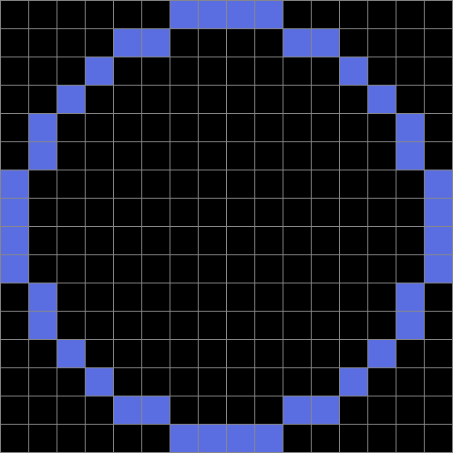

# pixel-art-scaler

pixel-art-scaler is a tool to enlarge pixel art for plaforms that blur it when you upload to them.

## Why use this tool

Has the following happended to you before. you have a low res image that is meant to be viewed
with anti-aliasing off, you upload it to some plaform that when completly destroys it like this

`orignal:`

**smooth:**

NOTE: if the `pixelated` images look blurry, then you are viewing this on a plaform that does not support the `image-rendering` CSS property, and it is for reasons like this that this tool was made

**pixelated:**

NOTE: if the `pixelated` images look blurry, then you are viewing this on a plaform that does not support the `image-rendering` CSS property, and it is for reasons like this that this tool was made

The images you see above are all from 2 files only, the difference is the size and the
image-rendering technique (you are seeing the different techniques available in the browser,
you can read more at [MDN Web Docs][MDN Web Docs image-rendering]) , when dealing with
pixel art you do not want smoothing to happen as it makes the image way too different
from the intended way to view it. 
In the case of the web you can change the image-rendering technique but that is not always an option

This is where this program comes in, it enlarges pixel art while keeping them pixelated, it also supports adding a grid to seperate the pixels (useful if you want to indicate the pixel boundaries)

NOTE: these images are rendered using smooth rendering

Even with the smooth rendering, the picture's pixel art is still recognizable.

[MDN Web Docs image-rendering]: https://developer.mozilla.org/en-US/docs/Web/CSS/image-rendering

